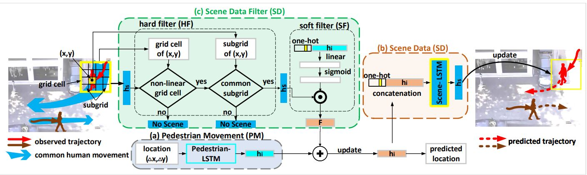

# Scene-LSTM




This code/implementation is available for research purposes. If you are using this code/data for your work, please cite the following paper:

> Huynh, Manh, and Gita Alaghband. "Trajectory prediction by coupling scene-LSTM with human movement LSTM." International Symposium on Visual Computing. Springer, Cham, 2019.

The code are a bit messy for now, we are doing some clean-ups. If you have any questions/inquiries, please send email to manh.huynh@ucdenver.edu. 

# This repository contains
 :heavy_check_mark: Processed data (in pixel and meter metrics) for ETH and UCY datasets. This data was also used in SGAN method.
 ```bash
 ├── data 
 │     ├── pixel/*.txt
 │     ├── meter/*.txt
  ```
 :heavy_check_mark: Scripts to convert pixel to meter and vice versa. Double check the paths to 
 homography matrices and input files.

 ```bash
 ├── data_utils
 │     ├── homography_matrix/*.txt
 │     ├── eth_utils/*.m (matlab scripts to process eth data)
 │     ├── data_utils/*.m (matlab scripts to process ucy data))
 ```
 All of the following items are available: 
- Visualization scripts. 
- My implementation for LSTM. 
- My implementation for Social-LSTM. 
- My implementation for Scene-LSTM. 

# Dependencies
The code was tested on Centos 7.0 with python 3.6.8 and pytorch 1.0.0.\
The environment was setup using conda 4.5.12. Additional packages should be installed.


